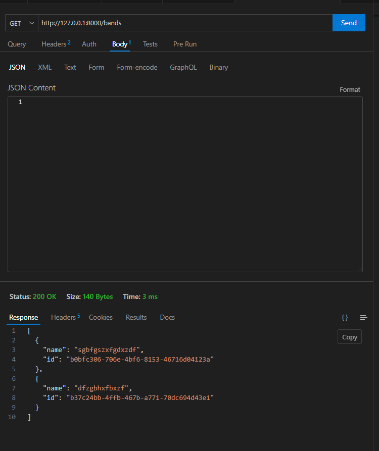
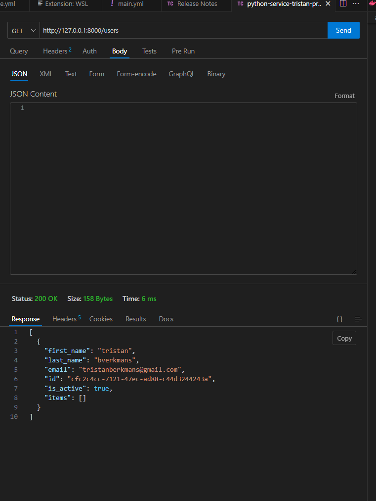
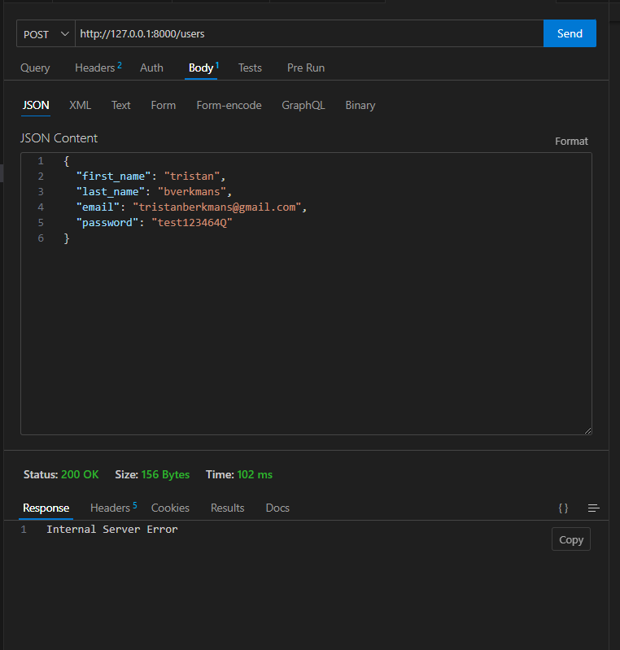
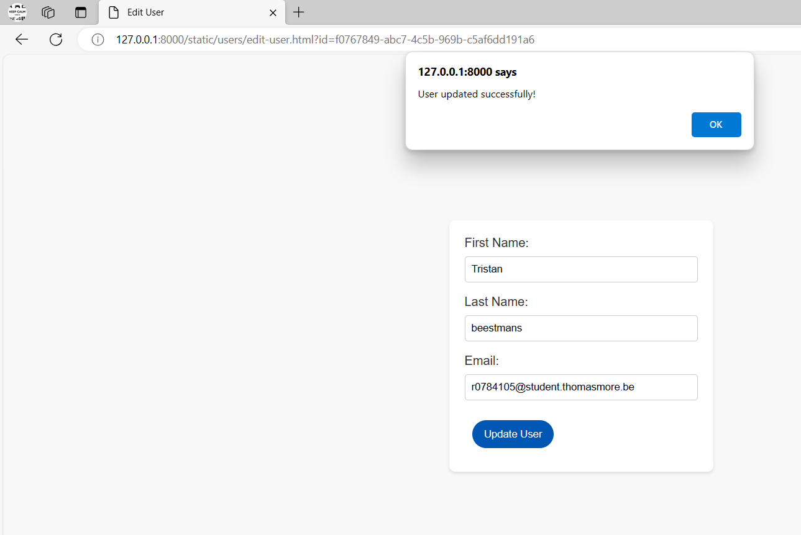

# eindopdracht_api

Voor de eindopdracht van api development wou ik graag een web app maken waar je de mogelijkheid om festivals te organiseren. Zo zou een gebruiker een poduim kunnen toevoegen dat koppelen aan een festival. Op deze poduims zouden ze dan de keuze kunnen maken om een band toe tevoegen. 

Het was de bedoeling om op een heel efficiente manier een lineup te kunnen creeren van een festival, met meerdere mensen tegen gelijk er tijd.

Hier onder de criterias van de opdracht en waarom ik deze wel of niet heb bereikt.

1. ❔ ALGEMENE EISEN & DOCUMENTATIE (alles samen +50%)

Minstens 3 GET, 1 POST, 1 PUT en 1 DELETE endpoints
Ik heb meerdere post voor elk verschillend thema 1 niet alle post werken maar er werkt er minstens 1. Dan heb ik een put om een gebruiker te kunnen aanpassen. een delete voor een gebruiker te kunnen verwijderen ddit is heel mooi uitgewerkt in HTML en CSS. Een get voor een gebruiker een get voor alle gebruikers een get voor specifieke gebruiker een get voor bands ....

Minstens 3 entiteiten in je API via een SQLite databank
database overzicht

Minstens hashing en OAuth implementeren
Terug te vinden in AUTH.py

Beschrijving van het gekozen thema, je API(s) en je uitbreidingen + link naar de zaken die hosted zijn op GitHub README.md
wat we op dit moment hebben in de browser is het toevoegen verwijderen en veranderen van gebruikers. en dan toevoegen van verschillende zaken zouals bands poduims en festivals, remark voor een of andere reden werken deze zaken alleen locaal (ligt aan mijn database... Heb niet gevonden hoe ik dit kon oplossen)
Volledige OpenAPI docs screenshot(s) op GitHub README.md

[a link](https://github.com/tristan-project/eindopdracht_api/blob/main/readme/readme2.md)
[a link](https://python-service-tristan-project.cloud.okteto.net/openapi.json) 

Logisch gebruik van path parameters, query parameters en body
ok

Docker container voor de API(s), welke automatisch door GitHub Actions opgebouwd wordt
ok

Deployment van de API container(s) op Okteto Cloud via Docker Compose
ok

https://python-service-tristan-project.cloud.okteto.net/static/index.html

Test alle GET endpoints van een van je APIs via de Requests en pytest library met een testfile in de root van je repository.
no

2. 🔧 AANVULLINGEN: FUNCTIE

2.1 (+5%) Test alle niet-GET endpoints.
ok

2.2 (+5%) Zorg ervoor dat de testfile ook tijdens de GitHub Actions gerund wordt.
ok

3. 📳 AANVULLINGEN: FRONT-END

3.1 (+15%) Maak een front-end voor je applicatie die al je GET endpoints en POST endpoints bevat.
ok

3.1.1 (+10%) Host de front-end op Netlify. 

3.1.2 (+10%) Geef de front-end een leuke stijlgeving.
ok 

3.1.3 (+15%) Gebruik Vue, React, Angular of Svelte als JavaScript framework.

3.2 (+15%) Maak gebruik van de Grafana Cloud gratis tier om een Grafana oplossing op te zetten om je API te consumen.

4. 📝 AANVULLINGEN: DATA

4.1 (+20%) Maak een tweede versie van je originele API, maar deze keer gebruik je MongoDB Atlas i.p.v. een SQL oplossing. Je plaatst deze in een nieuwe GitHub repository, met als README.md een korte uitleg van de verschillen.

4.1.1 (+15%) Vervang MongoDB Atlas door een MongoDB container die bij in je deployment zit. Mét volume.

4.2 (+30%) Zet een ActiveMQ message queue systeem voor een endpoint van je API, dit zit tevens ook als container in je deployment.

5. 🔐 AANVULLINGEN: SECURITY

5.1 (+25%) Maak een tweede versie van je originele API, maar deze keer gebruik je Open ID Connect via Okta als Auth oplossing i.p.v. je eigen OAuth implementatie. Je plaatst deze in een nieuwe GitHub repository, met als README.md een korte uitleg van de verschillen.

5.2 (+30%) Deploy een Spring Boot Cloud Gateway (zelf geprogrammeerd) / KrakenD Gateway (zelf geconfigureerd) / Kong Gateway (zelf geconfigureerd) voor een van je APIs. Zorg ervoor dat je endpoints door de Gateway beschermd worden via een check op een token. Eventuele endpoints waarmee je authentiseert zoals /token enz. moeten natuurlijk niet gecheckt worden, aangezien je eerst een token moet kunnen bekomen.
